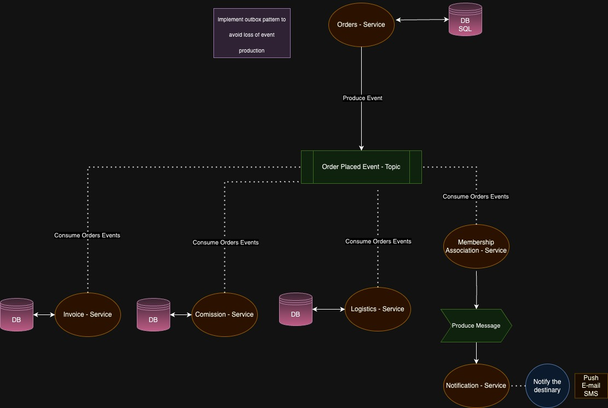

# Getting Started

This is a sample application showcasing the use of Clean Architecture with Domain-Driven Design (DDD), Kafka, Spring Boot, and PostgreSQL. The application is designed to demonstrate the separation of concerns and the modularity of different layers.

## Table of Contents

- [Introduction](#introduction)
- [Architecture Definition](#architecture-definition)
- [Prerequisites](#prerequisites)
- [Setup](#setup)
    - [Clone the repository](#clone-the-repository)
    - [How to execute local tests](#how-to-execute-local-tests)
    - [How to start the application](#how-to-start)
- [Starting the flow](#triggering-the-flow)
- [Access Kafka Control Center Dashboard](#access-kafka-control-center-dashboard)

## Introduction

This application serves as a template for building scalable and maintainable Java applications using modern technologies. It employs Clean Architecture to separate the core business logic from the external components, making it easier to adapt to changes in the future.

## Architecture Definition




## Prerequisites

Before you begin, ensure you have the following installed:

- Java 21
- Apache Gradle
- Docker
- Curl

## Setup

1. Clone the repository:
     ```
     git clone https://github.com/mateusrfiuza/orders.git
      cd orders
     ```
2. How to execute local tests:
     ```
      ./gradlew test
     ```
3. How to start the application:
     ```
      ./gradlew clean build bootRun
     ```


#### Triggering the flow:
1. This endpoint will trigger an order creation, that will orchestrate the sequence
  ```
      curl --location '127.0.0.1:8080/orders' \
      --header 'Content-Type: application/json' \
      --data '{
        "sellerId": "sampleSellerId",
        "customerId": "sampleCustomerId",
        "items": [
          {
            "quantity": 2,
            "itemId": "item1"
          },
          {
            "quantity": 1,
            "itemId": "item2"
          }
        ],
        "orderDate": "2024-01-15T12:30:00Z",
        "currency": "USD"
      }
      '
  ```


#### Access Kafka Control Center Dashboard:
1. Open your browser
2. Type in URL bar `http://127.0.0.1:9021/`
